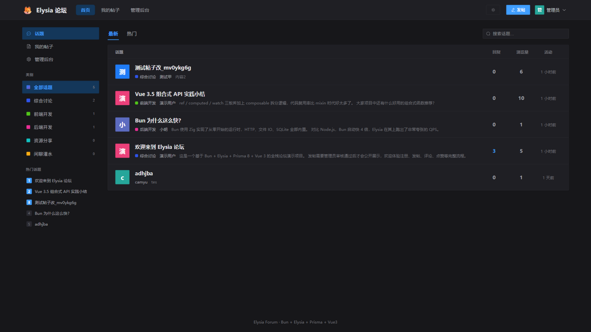
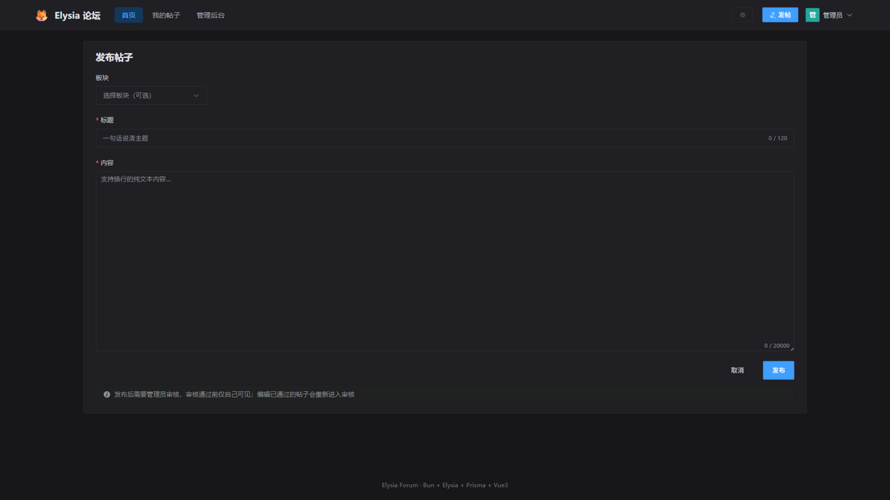
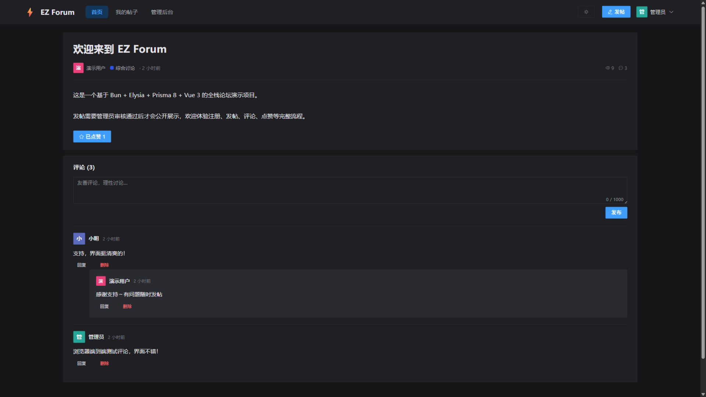
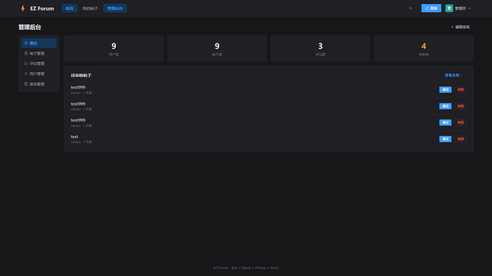
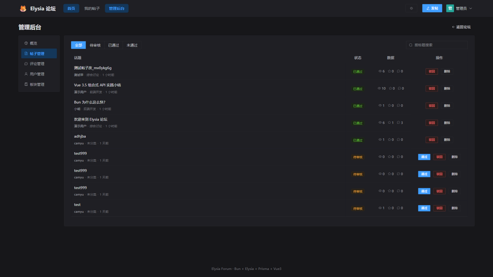
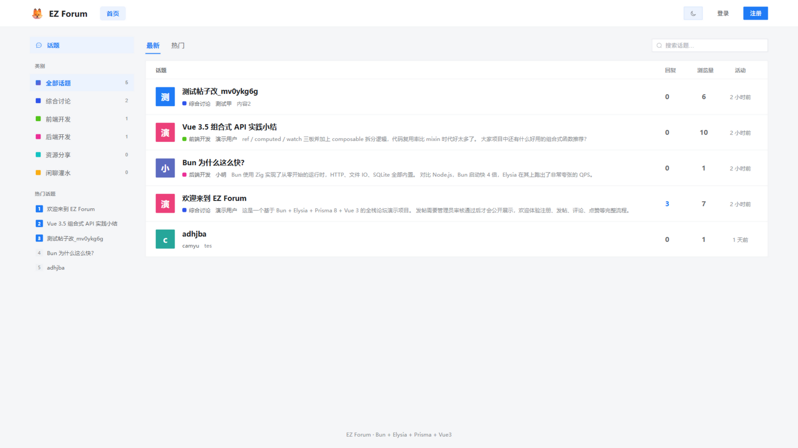

<div align="center">

# ⚡ EZ Forum

用 Bun + Elysia + Prisma + Vue 3 写的论坛。功能不算多，但每个都是完整的——包括审核、权限这些通常被 demo 省略掉的部分。

[快速开始](#快速开始) · [功能](#功能) · [API](#api-一览) · [安全](#安全措施) · [部署](#部署)



</div>

---

## 这是个什么项目

一个可以实际使用的论坛：用户注册登录、在板块下发帖，帖子先审后发，读者评论点赞，管理员在后台处理内容和用户。前后端都是 TypeScript，数据在你自己的 PostgreSQL 里。

它不是教学用 demo。教程项目通常会省掉那些麻烦但必要的部分——内容审核、权限归属、级联删除、接口限流——这个项目把这些做完整了，所以代码比典型教程多一些，但放进真实环境不需要先补一堆窟窿。

## 为什么要自己写一个

现有方案的体验大概是这样：

- **Discourse**：功能最全，但要跑 Ruby，实例内存 1~2GB 起步，个人玩家先为 VPS 月费犹豫
- **Flarum 等 PHP 论坛**：轻一些，插件质量参差，装齐功能后的维护成本不比 Discourse 低
- **SaaS 社区**：注册就能用，但数据、规则、生死都在平台手里
- **GitHub 上的练手项目**：能跑，但常见的问题是密码明文、SQL 拼接、没有权限设计——论坛恰好是用户数据的重灾区，这些恰恰不能省

EZ Forum 走了条中间路线：技术栈轻（Bun + PostgreSQL），功能不做大而全，但安全和治理的部分按真实项目的标准做。

## 功能

### 发帖与审核

帖子提交后进入待审核状态，管理员通过后才对外展示；编辑已通过的帖子会重新回到待审核。支持板块归类、标题关键词搜索、按最新或最热（点赞数）排序，全部分页。浏览量只在帖子对外可见后才开始累计。

发布页长这样：



### 评论与点赞

两级评论（一级评论 + 回复），删除一级评论时回复一并删除，帖子上的评论计数随后重新对账。点赞一人一票、可以取消，计数按实际数据校准，并发下不会漂。

详情页：



### 用户与权限

注册永远是普通用户，管理员由脚本创建或提升。登录签发 7 天有效期的 JWT，每次请求都会核对账号是否还存在——注销后旧 token 立即作废。改资料、注销账号只能本人操作，注销会连带删除其全部帖子和评论，操作前有二次确认。

### 管理后台

概览页有用户、帖子、评论、待审核四个数字和待审列表；帖子支持按状态筛选、按标题搜索、通过 / 驳回 / 删除；用户可以改角色、删除；板块可以增删改。管理员不能删除或降级自己。





### 深色与浅色

两套主题一键切换，偏好存在浏览器本地。界面是直角、高对比的样式，按 1920×1080 排版，窄屏会自动收成单列。



## 快速开始

> [!NOTE]
> 前置要求：[Bun](https://bun.sh) 1.1+ 和 PostgreSQL 15+。装完想先看看效果，跑一遍 seed 就有演示数据（账号 `demo / demo12345678`）。

```bash
# 0. 配置环境变量（数据库连接串 + JWT 密钥，密钥建议 openssl rand -hex 32 生成）
cp .env.example .env

# 1. 安装依赖（后端 + 前端）
bun install
cd web && bun install && cd ..

# 2. 初始化数据库
bun prisma db init        # 首次建表；之后改了契约用下面两条
bun run contract:emit     # 修改 contract.prisma 后重新生成类型
bun run db:update         # 把契约变更应用到数据库

# 3. 灌入演示数据（幂等，可重复执行）
bun run seed

# 4. 创建管理员（注册接口只产生普通用户，管理员只能这样建）
bun run admin:create <用户名> <密码> [昵称]

# 5. 启动
bun run dev               # 后端 http://localhost:3000
cd web && bun run dev     # 前端 http://localhost:5173（/api 代理到后端）
```

## 项目结构

```
├── src/                      # 后端
│   ├── index.ts              # 入口：环境校验 / cors / openapi / 统一错误处理
│   ├── router/               # user / post / comment / category / admin 路由
│   ├── plugins/auth.ts       # JWT 插件：signIn / signInOptional / adminOnly 权限宏
│   ├── dto/                  # TypeBox 请求校验 schema
│   ├── prisma/               # contract.prisma、db 客户端、原生 SQL 封装
│   └── utils/                # 统一响应结构、内存限流
├── scripts/                  # createAdmin / seed / apiTest
├── migrations/               # Prisma 迁移快照
├── docs/screenshots/         # README 截图
└── web/                      # 前端
    └── src/
        ├── api/              # 请求封装与接口定义
        ├── stores/           # Pinia：登录态 / 主题
        ├── router/           # 路由与守卫
        ├── layouts/          # 默认布局 / 管理后台布局
        ├── components/       # PostCard / CommentTree / Avatar / CategoryBadge
        ├── views/            # 页面（admin/ 为后台）
        └── utils/            # 时间格式化、色板
```

## API 一览

前缀 `/api`，内置 OpenAPI 文档：<http://localhost:3000/openapi>

| 模块 | 接口 |
| --- | --- |
| 用户 | `POST /user` 注册 · `POST /user/login` 登录 · `GET /user/me` · `GET /user/:id` 主页 · `PATCH /user/:id` · `DELETE /user/:id` 注销 |
| 帖子 | `GET /post` 公开列表 · `GET /post/mine` 我的 · `GET /post/:id` 详情 · `POST /post` · `PATCH /post/:id` · `DELETE /post/:id` · `POST /post/:id/like` 点赞 |
| 评论 | `GET /comment/post/:id` · `POST /comment/:id` · `DELETE /comment/:id` |
| 板块 | `GET /category` · `POST /category` · `PATCH /category/:id` · `DELETE /category/:id`（管理员） |
| 管理 | `GET /admin/stats` · 用户管理 · 帖子审核 · 评论管理（均需管理员权限） |

响应格式全站统一：成功 `{msg, data}`，分页多 `page / pageSize / total`，失败 `{msg}` 加对应的 HTTP 状态码。

## 安全措施

- 密码用 `Bun.password`（Argon2id）哈希；登录失败统一文案，并做一次假哈希运算抹平时间差，防止枚举用户名
- JWT 7 天过期，每次请求回库核对账号是否存在，注销后旧 token 立即作废
- 登录和注册有基于 IP 的滑动窗口限流（内存版，多实例部署要换 Redis）
- SQL 全部走 ORM 参数化；原生 SQL 用标签模板传参，LIKE 关键词转义 `%` 和 `_`
- 所有输入经 TypeBox 校验（类型、长度、枚举），请求体上限 1MB
- 管理员不能降级或删除自己；前端纯文本渲染，没有 `v-html`
- 启动时检查 `JWT_SECRET`（至少 32 字符）等环境变量，缺了直接拒绝启动

## 部署

1. 配置生产环境的 `DATABASE_URL` 和强随机 `JWT_SECRET`，`CORS_ORIGIN` 建议设为站点域名
2. 后端：`bun prisma db update` 同步数据库，然后 `bun run src/index.ts`（配 systemd / pm2 守护）
3. 前端：`cd web && bun run build`，把 `web/dist` 交给 Nginx / Caddy，`/api` 反代到 3000 端口

## 测试

```bash
# 后端 API 冒烟测试：58 项断言，覆盖注册登录、审核流、权限、级联删除、限流
bun scripts/apiTest.ts <管理员用户名> <管理员密码>

# 前端类型检查 + 生产构建
cd web && bun run build
```

## 已知限制

说出来省得你踩坑：

- Prisma 8 RC 的查询构建器只支持等值条件，模糊搜索和联表统计走的是 `src/prisma/raw.ts` 里的原生 SQL（已全部参数化），正式版发布后可以换回构建器
- 限流是单机内存版，多实例部署要自己换 Redis
- 帖子是纯文本展示，没有 Markdown 渲染；需要的话前端加 markdown-it 记得做 sanitize
- 没有邮件验证和找回密码
- 移动端能看，但没做深度适配

## 反馈

问题提 [Issue](../../issues)，附上复现步骤和接口响应，修起来快很多。
